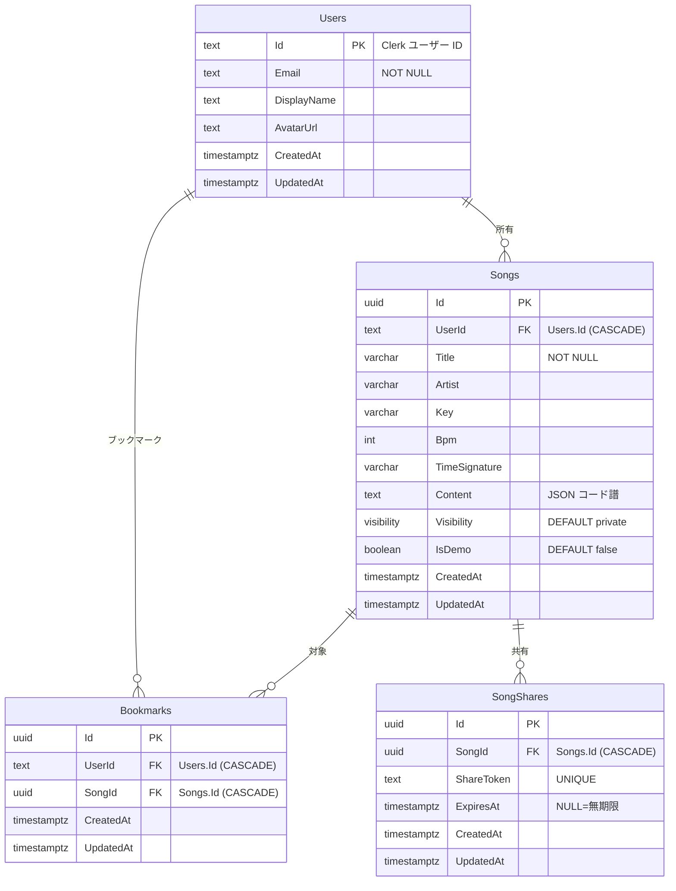

# データベース設計

ChordBook のデータベース設計を説明します。

## ER図



## リレーションシップ

| 関係               | 説明                                             |
| ------------------ | ------------------------------------------------ |
| Users → Songs      | 1対多: 1人のユーザーは複数の曲を所有できる       |
| Users → Bookmarks  | 1対多: 1人のユーザーは複数のブックマークを持てる |
| Songs → Bookmarks  | 1対多: 1曲は複数のユーザーにブックマークされる   |
| Songs → SongShares | 1対多: 1曲は複数の共有リンクを持てる             |

## テーブル定義詳細

### Users

ユーザー情報を管理するテーブル。Clerk と連携。

| カラム      | 型           | NULL | デフォルト | 説明                        |
| ----------- | ------------ | ---- | ---------- | --------------------------- |
| Id          | TEXT         | NO   | -          | 主キー（Clerk ユーザー ID） |
| Email       | VARCHAR(255) | NO   | -          | メールアドレス（ユニーク）  |
| DisplayName | VARCHAR(100) | YES  | NULL       | 表示名                      |
| AvatarUrl   | VARCHAR(500) | YES  | NULL       | アバター画像URL             |
| CreatedAt   | TIMESTAMP    | NO   | now()      | 作成日時                    |
| UpdatedAt   | TIMESTAMP    | NO   | now()      | 更新日時                    |

### Songs

コード譜の楽曲情報を管理するテーブル。

| カラム        | 型           | NULL | デフォルト        | 説明                          |
| ------------- | ------------ | ---- | ----------------- | ----------------------------- |
| Id            | UUID         | NO   | newguid()         | 主キー                        |
| UserId        | TEXT         | NO   | -                 | 所有者（FK → Users）          |
| Title         | VARCHAR(200) | NO   | -                 | 曲名                          |
| Artist        | VARCHAR(200) | YES  | NULL              | アーティスト名                |
| Key           | VARCHAR(10)  | YES  | NULL              | キー（C, Am, etc.）           |
| Bpm           | INT          | YES  | NULL              | テンポ                        |
| TimeSignature | VARCHAR(10)  | YES  | NULL              | 拍子                          |
| Content       | TEXT         | NO   | '{"sections":[]}' | コード譜データ（JSON 文字列） |
| Visibility    | visibility   | NO   | 'private'         | 公開設定（ENUM、後述）        |
| IsDemo        | BOOLEAN      | NO   | false             | デモ用曲フラグ                |
| CreatedAt     | TIMESTAMP    | NO   | now()             | 作成日時                      |
| UpdatedAt     | TIMESTAMP    | NO   | now()             | 更新日時                      |

### Bookmarks

ユーザーのブックマーク（お気に入り）を管理するテーブル。

| カラム    | 型        | NULL | デフォルト | 説明                   |
| --------- | --------- | ---- | ---------- | ---------------------- |
| Id        | UUID      | NO   | newguid()  | 主キー                 |
| UserId    | TEXT      | NO   | -          | ユーザー（FK → Users） |
| SongId    | UUID      | NO   | -          | 曲（FK → Songs）       |
| CreatedAt | TIMESTAMP | NO   | now()      | 作成日時               |
| UpdatedAt | TIMESTAMP | NO   | now()      | 更新日時               |

**ユニーク制約**: (UserId, SongId)

### SongShares

曲の共有リンクを管理するテーブル。

| カラム     | 型          | NULL | デフォルト | 説明                       |
| ---------- | ----------- | ---- | ---------- | -------------------------- |
| Id         | UUID        | NO   | newguid()  | 主キー                     |
| SongId     | UUID        | NO   | -          | 曲（FK → Songs）           |
| ShareToken | VARCHAR(50) | NO   | -          | 共有用トークン（ユニーク） |
| ExpiresAt  | TIMESTAMP   | YES  | NULL       | 有効期限（NULL=無期限）    |
| CreatedAt  | TIMESTAMP   | NO   | now()      | 作成日時                   |
| UpdatedAt  | TIMESTAMP   | NO   | now()      | 更新日時                   |

## 列挙型

### Visibility（公開設定）

PostgreSQL の `visibility` ENUM 型:

| 値               | 説明                  |
| ---------------- | --------------------- |
| `private`        | 非公開（作成者のみ）  |
| `url_only`       | URLを知っている人のみ |
| `specific_users` | 特定ユーザーのみ      |
| `public`         | 全員に公開            |

## Content カラムの JSON 構造

Songs.Content には `{ "sections": [...] }` 形式でコード譜データが格納されます。各セクションの `content` フィールドに `{ "lines": [...] }` 形式の JSON 文字列を持ちます。

```json
{
  "sections": [
    {
      "id": "section-1",
      "name": "イントロ",
      "type": "chord-only",
      "content": "{\"lines\":[{\"id\":\"line-1\",\"lyrics\":\"\",\"chords\":[{\"id\":\"chord-1\",\"chord\":\"C\",\"offset\":0.2}]}]}"
    }
  ]
}
```

詳細は [tables.md](./tables.md) を参照。

## インデックス

| テーブル   | カラム           | 種類   | 説明                 |
| ---------- | ---------------- | ------ | -------------------- |
| Users      | Email            | UNIQUE | メールアドレス検索   |
| Songs      | UserId           | INDEX  | ユーザーの曲一覧取得 |
| Songs      | Visibility       | INDEX  | 公開曲の検索         |
| Bookmarks  | UserId           | INDEX  | ブックマーク一覧取得 |
| Bookmarks  | (UserId, SongId) | UNIQUE | 重複防止             |
| SongShares | ShareToken       | UNIQUE | トークンによる曲取得 |

## 関連ドキュメント

- [API仕様](../api/endpoints.md) - CRUD操作のAPI
- [バックエンドアーキテクチャ](../architecture/backend.md) - Hono + Drizzle ORM
